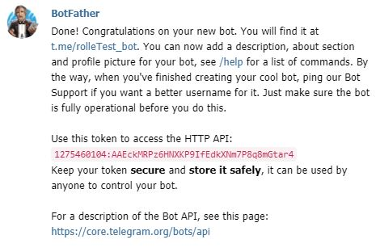
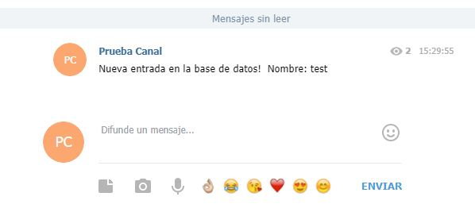
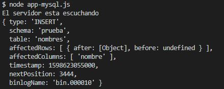

# Ejemplo Bot Telegram

Ejemplo de bot telegram utilizando un rss o eventos de la base de datos. 

## Descripción

El ejemplo es una aplicación de **express** que escucha un endpoint para que el bot reciba ordenes y así devuelva acciones como respuestas u otros (viable para poder realizar modificaciones directamente desde el propio bot).

El ejemplo consta de dos partes, la primera corresponde a la configuración y posibles usos del bot y la segunda a la manera de recoger posibles noticias nuevas a publicar de manera automatizada.

## Comandos

Para instalar:

    yarn 

Para arranchar alguno de los js:

    node app-(tipo).js

### **Bot Telegram**

Para poder desarrollar un bot en telegram, primero de todo necesitaremos, dentro de cualquier aplicación de telegram, mandar la orden al bot propio de telegram botFather para crear un nuevo bot, despues de darle un nombre, este nos devolverá un token que es el que usaremos dentro de la aplicación.

Una vez que dispongamos del token dentro de nuestro node, utilizaremos la librería **[Telegraf](https://telegraf.js.org/ "Telegraf")** para poder recibir y enviar diversos mensajes en según qué condiciones.

A la instancia de Telegraf debemos facilitarle el endpoint donde mandará los mensajes que reciba el bot a través de Telegram. El endpoint tiene que corresponder a una dirección publica y no localhost, si no no funcionará.

Para poder realizar este ejemplo desde localhost he utilizado la herramienta **[Ngrok](https://ngrok.com/ "Ngrok")** que permite acceder nuestro servidor local a cualquier persona en internet con la que compartamos una url generada dinamicamente. Simplemente tenemos que facilitar el puerto que queremos que escuche peticiones externas y éste nos facilitará una dirección publica que redirecciona a nuestro puerto, en nuestro caso utilizamos el puerto 3000:

    ngrok http 3000

Una vez que nos facilite la dirección cogeremos la dirección https que nos devuelve puesto que Telegram necesita que el protocolo sea seguro:

Finalmente cuando ya tenemos el express escuchando ese endpoint y telegram preparado para enviar mensajes al bot a través de ese endpoint solo queda especificar qué hacer cuando se recibe un mensaje específico, en este caso la orden que esperamos es /test, y la respuesta es el mensaje "Hola mundo bot"

    bot.command('/test', ctx => {
      console.log('COMANDO TEST')
      ctx.reply('Hola Mundo Bot')
    })

Y el resultado es el siguiente:

De esta manera se podría definir una serie de comandos de configuración directamente desde el propio bot si estuviese lanzado dicho **app.js** de manera constante.

### **LECTURA DE NOTICIAS**

A la hora de automatizar el envío de noticias para enviarlo en un canal especifico se ha creado un canal de prueba y añadido como administrador al propio bot anteriormente configurado. He encontrado dos maneras de automatizar el envío. El primero es leyendo un rss y comparar los items de ese rss con los items de la copia anterior guardada como json y el otro modo es a traves de los eventos que dispara la base de datos donde estan guardadas las noticias

#### **RSS**

Como muchos medios, RTVE provee un sistema de Rss para compartir sus noticias por secciones. En este ejemplo, se parsea ese Rss con el Rss-parser:

    let Parser = require('rss-parser');
    let parser = new Parser();
    const rssFeed = async () => {
      let feed = await parser.parseURL('http://api2.rtve.es/rss/temas_deportes.xml');
    };

En caso de no tener guardado un json con el parseo anterior de ese Rss, se guarda dicho json para que la proxima vez, se compare el nuevo parseo, y si hay noticias nuevas, el bot publique las noticias nuevas que no coincidan con la versión guardada. Posteriormente, la versión rss guardada se actauliza con la nueva. (ver código en app-rss debido a su extensión)

Dicha ejecución debería programarse en una tarea del servidor para que cada X tiempo compare diferencias y así de manera automatizada publicase nuevas noticias por ahora para el ejemplo generamos un intervalo con un tiempo de un minuto.

Cada vez que se realicen cambios debemos recibir en la consola el siguiente mensaje: 

y el resultado en el canal es el siguiente:

#### **EVENTOS**

Este ejemplo permite que el bot pueda estar lanzado directamente y sólo publique mensajes en el canal cuando haya una inserción o modificación de una noticia. Se ha buscado la manera de hacerla por MongoDB y por MYSQL.

#### MongoDB
Para poder ejecutar eventos en una base de datos Mongo utilizamos la funcionalidad **[ChangeStream](https://docs.mongodb.com/manual/changeStreams/ "ChangeStream")**. 

**IMPORTANTE**. 

Para que esta funcionalidad tenga efecto debemos de instanciar el servicio de mongo en modo [replica set](http://www.jorgehernandezramirez.com/2018/03/24/mongodb-replica-set/ "Replica set"). Éste es un mecanismo que nos proporciona MongoDB para garantizar la alta disponibilidad de nuestras bases de datos. La idea consiste en tener corriendo varias instancias de mongo con el fin de que la información se replique entre ellas, de tal forma que si el nodo primario se cae, pueda ser sustituido por otro. 

    mongod --replSet m101 --dbpath /data/rs1 --port 27017
    mongod --replSet m101 --dbpath /data/rs2 --port 27018
    mongod --replSet m101 --dbpath /data/rs3 --port 27019

    -------------------------
    mongo --port 27017
    
    config = { _id: "m101", members:[
          { _id : 0, host : "localhost:27017"},
          { _id : 1, host : "localhost:27018"},
          { _id : 2, host : "localhost:27019"} ]
    };
    rs.initiate(config);

Para poder utilizarla, una realizada la conexión a Mongo, declaramos ese changeStream para que este escuchando en una colección específica de la base de datos.

Una vez declarada simplemente tenemos que declarar qué hacer cuando se dispara un evento según la condición, en nuestro caso 'on Change'

En este caso comprobamos si la operación que se ha realizado ha sido o una inserción o una modificación y le ordenaremos al bot que envíe en un canal específico un mensaje del documento que haya sido afectado.

    changeStream.on('change', next => {
      console.log(next);
      // process next document
      if(next.operationType === 'insert'){
        console.log('NUEVO ITEM', next.operationType, next.fullDocument);
        bot.telegram.sendMessage('@canalrolleprueba', 'Nueva entrada en la base de datos!\t Nombre: ' + next.fullDocument.name);
      }
      if(next.operationType === 'replace'){
        console.log('ITEM MODIFICADO', next.operationType, next.fullDocument);
        bot.telegram.sendMessage('@canalrolleprueba', 'Entrada modificada en la base de datos!\t Nombre: ' + next.fullDocument.name);
      }
    });

Cuando insertemos un documento la consola nos devolverá el siguiente resultado:

Y el resultado en Telegram será el siguiente:

#### MySQL

Con MySQL no he conseguido tener un buen ejemplo para mostrar, después de echar un ojo he encontrado varias librerías que dicen poder gestionar eventos de escritura y modificación de la base de datos desde Node pero sólo en una he podido reproducir un buen ejemplo, pero no siempre se cumple.

Las dos librerias son [ZongJi](https://www.npmjs.com/package/zongji "ZongJi") y [mysql-events](https://github.com/rodrigogs/mysql-events "mysql-events"). Para el primero no he conseguido hacer que funcione y en el segundo si he podido llegar a reproducir un ejemplo pero no siempre me funciona. En el segundo ejemplo he utilizado esta [guía](https://medium.com/@mohammedalrowad/monitoring-mysql-data-changes-in-real-time-via-nodejs-binary-logs-c379720c0333 "Guia con mysql-events").

En este caso primero tenemos que modificar el my.cnf de Mysql para añadir los siguientes valores para activar los binlog de mysql que se encargan de registrar los eventos producidos en las bases de datos:

    log-bin=bin.log
    log-bin-index=bin-log.index
    max_binlog_size=100M
    binlog_format=row
    socket=mysql.sock

Posteriormente solo tenemos que generar una conexión mysql en node para conectarnos a la base de datos e instanciar un MySQLEvents con el valor startAtEnd para que empiece a escuchar solo los eventos posteriores a la conexion:

    const instance = new MySQLEvents(connection, {
      startAtEnd: true 
    });

y luego añades un disparador que especifique la base de datos qué tiene que escuchar y lo que ocurre cuando se dispara el evento, en este caso, que el bot de telegram publique en un canal especifico lo sucedido en la base de datos, como por ejemplo una insercion de una noticia o una modificación de una noticia:

    instance.addTrigger({
      name: 'monitoring all statments',
      expression: 'test.*',
      statement: MySQLEvents.STATEMENTS.ALL, 
      onEvent: e => {
        bot.telegram.sendMessage('@canalrolleprueba', 'Nueva entrada en la base de datos!\t Nombre: ' + e.affectedRows.after.nombre);
        console.log(e);
        console.log(e.affectedRows.after.nombre);
      }
    });

Cuando el evento se dispara recibimos en la consola lo siguiente:

Y el resultado en el canal donde el bot escribe es el siguiente:

## Conclusion

Si nosotros tenemos la capacidad de configurar unas bases de datos desde 0, sin duda la mejor elección siempre será un funcionamiento por eventos, siempre y cuando se use en una base de datos de Mongo, puesto que para MySQL, las librerías para gestionar los eventos no parecen estar muy respaldadas ni tener suficiente fama como para recomendar su uso para el futuro. Este sistema brinda una eficiencia y un rendimiento alto frente a una tarea cron lanzada periodicamente.

Por Rss tenemos la facilidad de que muchos servicios de noticias ya brindan una manera de poder monitorizar sus noticias publicadas sin la necesidad de ser tan invasivos como en los metodos anteriores, es verdad que programar una tarea que se repita es menos eficiente y costoso puesto que muchas veces se lanzará una ejecución sin posibles cambios, pero nos permite tener un control mayor sobre lo que queremos hacer sin la necesidad de depender de configuraciones de bases de datos ajenas a nosotros.

## Principales Librerias requeridas

* [Telegraf](https://telegraf.js.org/ "Telegraf")
* [rss-parser](https://www.npmjs.com/package/rss-parser "rss-parser")
* [fs](https://nodejs.org/api/fs.html "fs")
* [mongodb](https://www.npmjs.com/package/mongodb "mongodb")
* [mysql](https://www.npmjs.com/package/mysql "mysql")
* [mysql-events](https://github.com/rodrigogs/mysql-events "mysql-events")

